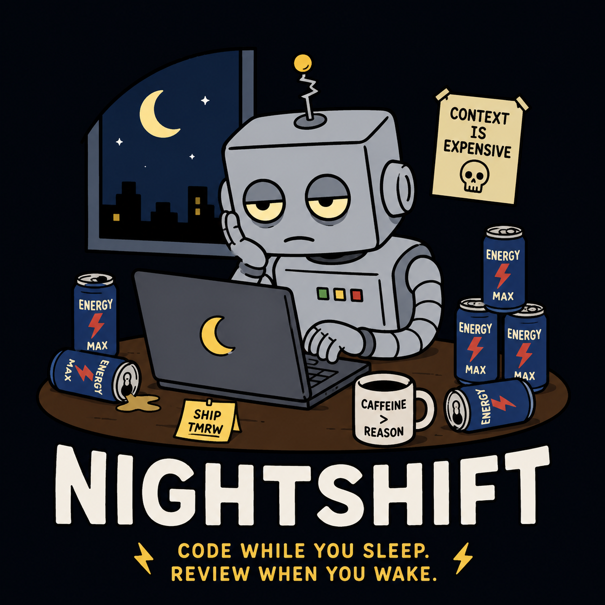

# NightShift



Auditable local-first AI coding pipelines.

NightShift is a deterministic pipeline runner for long-running AI-assisted coding workflows. It runs one markdown task at a time through a declarative YAML pipeline, records the important artifacts, and leaves the user with a reviewable work package.

NightShift is not an autonomous software engineer. It is an orchestration layer that treats AI agents as unreliable workers inside bounded, testable, auditable workflows.

## MVP Status

The core MVP is implemented:

- `nightshift init` creates starter config, task, and agent prompt files.
- `nightshift validate` checks config structure, prompt paths, task parsing, scoped paths, and command safety.
- `nightshift run` executes the next incomplete task.
- `nightshift run --task TASK-001` executes a specific task.
- Command-backed agents receive compact prompt bundles on stdin.
- Command stages run through allowlist and forbidden-fragment checks.
- Runs create `.nightshift/` artifacts, task context, retry context, command output, agent output, final notes, and run summaries.
- Unit tests cover config, safety, tasks, artifacts, commands, agents, pipeline retries, context, and reports.

## What NightShift Is

NightShift is built for reviewable automation:

- local-first execution
- declarative pipeline stages
- markdown task files
- command-backed agent wrappers
- explicit retry limits
- command allowlists
- scoped path checks
- durable markdown/text artifacts
- compact context handoff
- final reports for human review

The goal is to wake up to useful artifacts and a repository state you can inspect.

## What NightShift Is Not

NightShift does not try to autonomously ship code. It does not push branches, deploy software, run arbitrary hooks, execute parallel task swarms, or grant agents unlimited repository access. Human review remains the final authority.

## Install

Development install:

```bash
pip install -e .
```

You can also run the CLI module directly from a checkout:

```bash
python -m nightshift.cli --help
```

NightShift currently uses the Python standard library for runtime behavior. PyYAML is used automatically if installed, but the starter config works with the built-in YAML subset parser.

## Quickstart

Create starter files:

```bash
nightshift init
```

Validate the project:

```bash
nightshift validate
```

Run the next incomplete task:

```bash
nightshift run
```

Run a specific task:

```bash
nightshift run --task TASK-001
```

Review artifacts:

```text
.nightshift/runs/<run-id>/
```

## Task File Example

Tasks live in markdown checklist format:

```markdown
# Tasks

- [ ] TASK-001: Add YAML config loading

Description:
Implement config loading for NightShift.

Acceptance Criteria:
- Loads `nightshift.yaml`
- Validates required fields
- Returns typed config objects
- Includes tests
```

NightShift parses task id, title, completion state, description, acceptance criteria, optional dependency bullets, and raw task markdown.

## Config Example

```yaml
project:
  name: example-project
  root: .
  task_file: tasks.md
  artifact_dir: .nightshift

safety:
  require_clean_worktree: false
  scoped_paths:
    - .
  allowed_commands:
    - python -m unittest
  forbidden_commands:
    - rm -rf
    - git push
    - curl | bash

agents:
  planner:
    backend: command
    command: echo
    system_prompt: agents/planner.md

  implementer:
    backend: command
    command: echo
    system_prompt: agents/implementer.md

  reviewer:
    backend: command
    command: echo
    system_prompt: agents/reviewer.md

pipeline:
  max_task_retries: 3
  stages:
    - id: plan
      type: agent
      agent: planner
      output: plan.md

    - id: implement
      type: agent
      agent: implementer
      output: implementation-log.md

    - id: test
      type: command
      commands:
        - python -m unittest
      output: test-output.txt

    - id: review
      type: agent_review
      agent: reviewer
      on_fail: implement
      output: review.md

    - id: summarize
      type: summarize
      output: final-notes.md
```

## Agent Backends

The MVP supports `backend: command`.

NightShift builds a prompt bundle containing:

- system prompt
- stage id and type
- task markdown
- acceptance criteria
- project context
- task context
- previous stage output
- retry notes
- output contract

The prompt is passed to the configured command on stdin. stdout, stderr, exit code, duration, and the prompt are persisted as artifacts.

Review agents should emit:

```yaml
status: pass | fail | retry | escalate
reason: <short explanation>
next_stage: <optional stage id>
context_update: <compact useful note>
```

## Safety Model

NightShift validates paths and commands before execution.

Path safety:

- project roots are resolved with `pathlib`
- task files and prompt files must stay inside the project root
- artifact paths cannot escape `.nightshift/`
- task artifact writes cannot escape the task directory

Command safety:

- command stages must match `allowed_commands`
- forbidden fragments are blocked before allowlist acceptance
- command output and exit codes are recorded
- command stages stop at the first failing or timed-out command

The MVP does not push, deploy, create branches, or execute arbitrary Python hooks.

## Artifact Layout

A run creates human-readable artifacts:

```text
.nightshift/
  project-context.md
  runs/
    <run-id>/
      run-summary.md
      config.snapshot.yaml
      tasks/
        TASK-001/
          task.md
          context.md
          plan.md
          implementation-log.md
          test-output.txt
          review.md
          stage-results.md
          context-out.md
          final-notes.md
```

Artifacts are written even when a stage fails where possible.

## Development

Run tests:

```bash
python -m unittest discover -v
```

Compile-check modules:

```bash
python -m compileall nightshift tests
```

## Roadmap

Next major work:

- real local model wrappers
- stronger git safety and diff capture
- task completion updates
- dependency handling
- richer status command
- prompt and model experimentation
- optional branch isolation
- longer-run multi-task reports

NightShift remains oriented around reviewable output, not blind autonomy.
